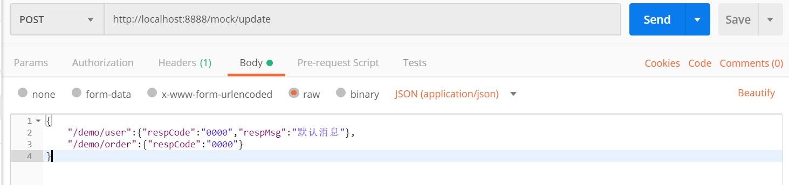
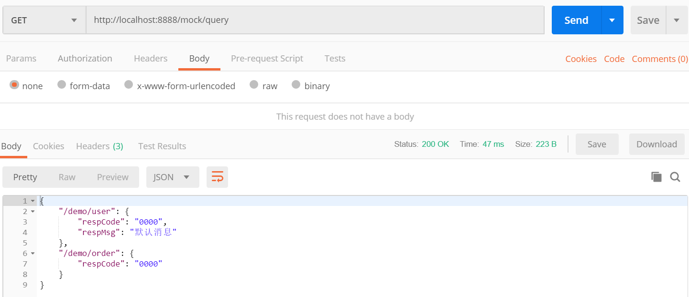
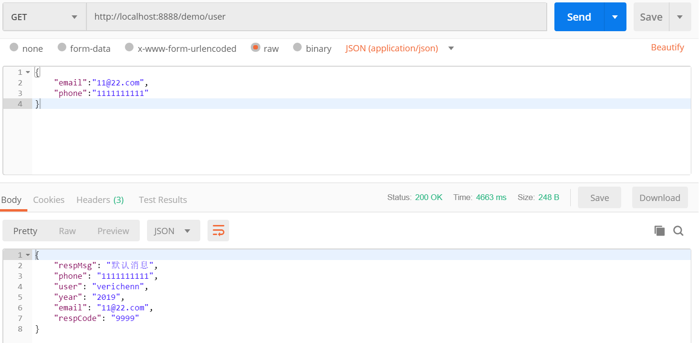

##### maven依赖

```xml
<dependency>
    <groupId>cn.com.bmac</groupId>
    <artifactId>mock-spring-boot-starter</artifactId>
    <version>0.0.1-SNAPSHOT</version>
</dependency>
```

##### 相关配置

```yaml
bmac:
  mock:
    #是否启用响应模拟
    enable: true 
    #拦截器拦截pathPatterns
    path-patterns: /demo/**
    #模拟数据控制器的uri,默认/mock
    base-uri: /mock
```

##### 具体操作

1. **POST** `http://ip:port/${base-uri}/update`

   - 设置动态响应数据

   

2. **GET**``http://ip:port/${base-uri}/query`

   - 查询动态响应数据

   

3. 编写业务Controller

   ```java
   @RestController
   @RequestMapping("/demo")
   public class DemoController {
   
       @GetMapping("/user")
       public Map user(){
           Map map = new HashMap();
           map.put("name","verichenn");
           map.put("year","2019");
           map.put("respCode","9999");
           map.put("respMsg","失败");
           return map;
       }
   
       @GetMapping("/order")
       public Map order(){
           Map map = new HashMap();
           map.put("orderId","12345678");
           map.put("amount","18");
           map.put("respCode","9999");
           map.put("respMsg","失败");
           return map;
       }
   }
   ```

4. 自定义响应模拟类，标注`@MockTarget`,`@MockTarget`的`value`=`@Controller`的`@RequestMapping`值

   ```java
   @MockTarget("/demo/user")
   @Component
   public class UserMockResponse implements MockResponse {
   
       @Override
       public Map customizeResponse(Map requestParams) {
           Map responseMap = new HashMap();
           responseMap.putAll(requestParams);
           responseMap.put("user","verichenn");
           responseMap.put("year","2019");
           return responseMap;
       }
   }
   ```

